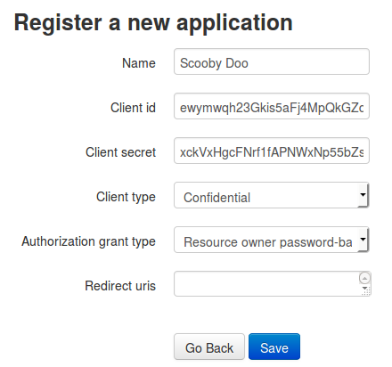

# Authentication

There are three options for authenticating with the API. The most appropriate option can be determined by considering if the API client is:

* another Django app running on the site (such as the built-in browsable API)? Use *session* authentication.
* a desktop/web/mobile client accessing the site externally? Use *OAuth2* authentication.
* a very simple external client mainly for development and debugging? Use *basic* authentication.

In the following sections, we explore how these different approaches can be used. It is assumed that you have already created a superuser account in Mezzanine.

## OAuth2 authentication

OAuth2 is the industry standard for API authentication and should be used to handle external API clients. 
With OAuth authentication, users can login to the OAuth2 App Manager and generate access tokens to authorize clients to access the API on their behalf. 
This access can be revoked by users at any point, for example if the access token falls into the wrong hands. 
A fresh access token can then be easily generated if neccessary.

### Creating an app

Open up the local OAuth2 App Manager at [http://127.0.0.1:8000/api/oauth2/applications/register/](http://127.0.0.1:8000/api/oauth2/applications/register/) in your browser. (If you are using API version <= 0.3.0, you may experience a 404 error. To resolve this, add the line `LOGIN_URL = "/api/auth/login/"` to your `settings.py`.)

OAuth2 provides *client types* and *grant types* for different API use cases. The client types consider whether a secret can be kept safe on the API client. They are defined as:

* **Confidential** for server-side apps running on a web server
* **Public** for JavaScript apps running in a web browser, desktop PC/laptop apps, or mobile apps

And the available grant types are as follows:

* **Authorization Code** for server-side apps
* **Implicit** for browser-based or mobile apps
* **Password** for logging in with a username and password
* **Client credentials** for apps to access their own account, outside the context of any specific user

Thus, for a mobile client app, we would choose the *Public* client type and the *Implicit* grant type. 

However, for this example, we consider a server-side app. Go ahead and register a new OAuth application. Just enter a reference name, choose `confidential` client type and 
`...password-based` authorization grant type:

### Receiving an Access Token

Request your access token to use for API authentication:

    $ curl -X POST -H "Accept: application/json; indent=4" \
      -d "grant_type=password&username=<username>&password=<password>" -u"<client_id>:<client_secret>" \
      http://localhost:8000/api/oauth2/token/

For `client_id` and `client_secret`, copy and paste those that you were given in the previous step. The `username` and 
`password` are the credentials of the Mezzanine user you wish to login as. You will get a JSON response like:

    {
        "access_token": "**<your_access_token>**",
         ...
    }

### Testing an app as client owner

The following test should *fail* (i.e. no user listings shown) if you are not currently authenticated:

    $ curl http://localhost:8000/api/users

    {
        "detail": "Authentication credentials were not provided."
    }

The following authenticated test should *succeed* and show you a list of users if you registered OAuth with a 
*superuser* account:    

    $ curl -H "Authorization: Bearer <your_access_token>" http://localhost:8000/api/users

You can also test your access token by entering it at the top of your local interactive API Resource Documentation page at [http://127.0.0.1:8000/api/docs/](http://127.0.0.1:8000/api/docs/).

## Basic authentication

Due to the complexity of OAuth2 authentication, basic authentication can be useful during development. 
However, basic authentication requires trusting your sensitive credentials with API client applications and passing your username and password on every request, so it is strongly discouraged for production use.

### Testing

The following test should *fail* (i.e. no user listings shown) if you are not currently authenticated:

    $ curl http://localhost:8000/api/users

    {
        "detail": "Authentication credentials were not provided."
    }

The following authenticated test should *succeed* and show you a list of users if you enter credentials of a Mezzanine *superuser* account:    

    $ curl --user '<your_username>:<your_password>' http://localhost:8000/api/users

## Session authentication

Session authentication is enabled primarily for the Browsable Web API. If you wish to use session based authentication for write access as well as read access, you will need to setup a valid CSRF token for any PUT or POST requests. See the [Django CSRF documentation](https://docs.djangoproject.com/en/dev/ref/csrf/#ajax) for more details.
