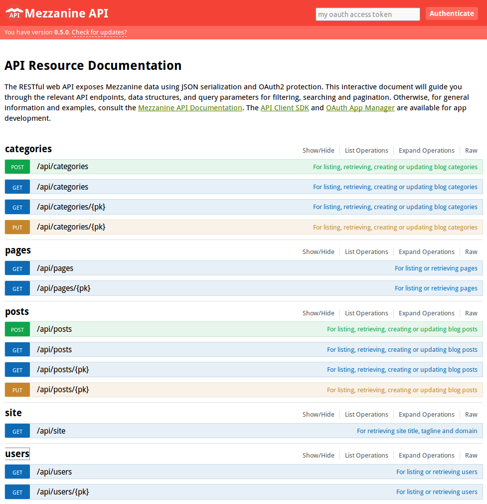
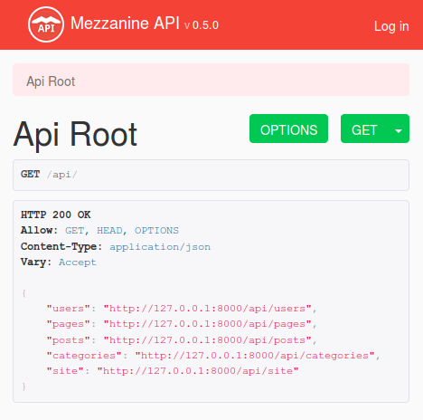

# Mezzanine API

## Overview

Mezzanine API is a **RESTful web API** for the popular [Mezzanine] content management platform. It is built upon the [Django] framework, using **JSON** for serialization and **OAuth2** for secure authentication. The API empowers developers to **automate, extend and combine Mezzanine with other services** such as mobile apps.

### Why use the API?

* **Freedom**: build mobile, web, or server apps and use whatever programming language you want
* **Speed**: harness a significant speed advantage over Mezzanine's Python based page views

### Access all the data your app needs

Intuitive REST API resources for posts, categories, comments, pages, users, and site/app metadata. Retrieving or updating data involves simply sending a HTTP request.

### Industry standard security

OAuth2, the industry standard for API authentication, allows users to authorize and revoke access to third party applications without the need for those applications to request the user's confidential credentials.

### Easily filter and search content
Apply filters such as `posts?date_min=2015-01-01&category=2` or search `posts?search=fitness` to narrow down results. Results are paginated to handle large datasets.

### Interactive endpoint documentation

The best way to learn about the API resources is via the interactive endpoint documentation which utilizes the popular [Swagger 
UI].

---

## Installation

In this section, we first explain how to create a new CMS API project. Alternatively, the latter sub-sections explain how to install into an existing Mezzanine project, or to install with Docker.

Remember to regularly check back here and on [PyPi]/[Github] for updates to the documentation and package, respectively. [Upgrade instructions and release notes](release-notes.md) are also available.

### New Project

Once you have [Python] (2.7 or 3.3+) installed on your system, a new API project can be created by running the following commands:

    $ pip install -U mezzanine-api
    $ mezzanine-project -a mezzanine_api project_name && cd $_
    $ python manage.py createdb --noinput
    $ python manage.py runserver

You should then be able to browse to [http://127.0.0.1:8000/admin/](http://127.0.0.1:8000/admin/) and login using the default account (username: admin, password: default).

### Existing project

Assuming you have an existing [Mezzanine] CMS project, the API can be installed into it as follows:

1. Install the `mezzanine-api` package using pip:

        $ pip install -U mezzanine-api

2. Add the following apps in this order to the top of `INSTALLED_APPS` in your Mezzanine `settings.py`:

        INSTALLED_APPS = (
            'mezzanine_api',
            'rest_framework',
            'rest_framework_swagger',
            'oauth2_provider',
            ...
        )

3. Add the API middleware to the top of `MIDDLEWARE_CLASSES` in `settings.py`:

        MIDDLEWARE_CLASSES = (
            'mezzanine_api.middleware.ApiMiddleware',
            ...

4. Also, add the following lines in your `settings.py` module
somewhere *before* the `LOCAL SETTINGS` block which is near the end:

        #####################
        # REST API SETTINGS #
        #####################
        try:
            from mezzanine_api.settings import *
        except ImportError:
            pass

5. For Mezzanine 4.1.0 and above, add the following code in your Mezzanine `urls.py` somewhere after `urlpatterns += [` (approx line 29):

        # REST API URLs
        url("^api/", include("mezzanine_api.urls")),

6. Migrate the database to support OAuth2:

        $ python manage.py migrate

7. Start the server:

        $ python manage.py runserver

### Docker

A [Docker file](https://github.com/gcushen/mezzanine-api-docker) is available for the API in a separate Github project. The Docker file is currently in beta and we welcome your feedback.

---

## Getting started

We recommend installing the [Mezzanine Client CLI](cli.md) or [Mezzanine Client SDK](client.md) on your local machine to get started using the API service remotely.

The best way to learn about the API resources is via the interactive resource documentation which utilizes the popular [Swagger 
UI]. Open up [http://127.0.0.1:8000/api/docs/](http://127.0.0.1:8000/api/docs/) in your browser, and if installation was successfull, you'll see the 
interactive endpoint resource documentation (refer to above screenshot). Here you can easily test out the 
different kinds of endpoint, method, and query parameter whilst you are learning.

Also, if you attempt to access the API itself directly in your browser, you will be shown a browsable web API:

In order to explore the restricted parts of the API, you can login via the browsable web API, or [retrieve your OAuth2 Access Token](authentication.md) 
to login at the top of the Interactive Resource Documentation page, or [login via command line with *curl*](authentication.md#basic-authentication).

Enjoy designing a frontend to interact with the REST API using your technology of choice! Alternatively, you can use it 
to automate, analyse, extend and combine Mezzanine with other services.

## Secure communication
**You SHOULD use HTTPS in production!**

In this guide, we consider a development environment on a local machine and connect to the server over HTTP. Whereas for production, you SHOULD use HTTPS for secure communication over the internet. Without it, all the API and Mezzanine authentication mechanisms can be compromised.

## Authentication
There are three options for authenticating with the API. The most appropriate option can be determined by considering if the API client is:

* another Django app running on the site (such as the built-in browsable API)? Use *session* authentication.
* a desktop/web/mobile client accessing the site externally? Use *OAuth2* authentication.
* a very simple external client mainly for development and debugging? Use *basic* authentication.

Please see the [Authentication](authentication.md) page for further details.

## Permissions
Some parts of the API are restricted and require authentication as a Mezzanine *user* or *superuser*.

Blog posts and categories may be created or updated over the API by a *superuser*. This enables you to make new blog posts, for 
example, using your own innovative frontend or web hooks. Note that this writable access is currently an experimental 
feature and should be used with caution. There are plans to gradually open up the rest of the API for write access over forthcoming releases. 

Member's only pages can only be accessed over the API if the requesting user is authenticated and has permission.

The `users` resource is generally restricted to superusers. However, a user may request to see their own details, and the blog post resource will embed the author's name (if they provided it) since blogs tend to operate on a real name basis. If you wish to customize this, take a look 
at the `UserSerializer` class.

## Parameters
Your local Resource Documentation at [http://127.0.0.1:8000/api/docs/](http://127.0.0.1:8000/api/docs/) includes a list of all available parameters for each possible request, but this section highlights some of the main categories.

### Filtering
The Resource Documentation shows you which resources you can filter on, and what to include in your URL query string. 
For example, to view only blog posts that mention fitness, use `/posts?search=fitness`.

### Pagination

In order to handle large datasets, pagination is employed. To be consistent, all *listing* type endpoints 
provide a structure that allows for pagination. Please use a "page" parameter to fetch multiple pages of records. For
 example listing categories with `categories?page=2` will return a JSON structure similar to this:
 
    {
        "count": 30,
        "next": "http://127.0.0.1:8000/api/categories?page=3",
        "previous": "http://127.0.0.1:8000/api/categories",
        "results": [{ ... }]
    } 

## CORS
The API supports requests and responses using Cross-Origin Resource Sharing (CORS). You may want to check out this excellent [tutorial](http://www.html5rocks.com/en/tutorials/cors/) for an overview on how to use CORS.

By default, API requests are allowed from any origin so you do not need to worry about the URIs of your API and client apps. You may disable this by adding the following line to your `local_settings.py`:

    MZN_API_CORS_ORIGIN_ALLOW_ALL = False

## Getting help
If you have questions about the API, consider leaving a message in our [Gitter chat room] or using the general [Mezzanine discussion group].

Otherwise, if you think you have found a bug, please use [GitHub issues] and include the steps necessary to reproduce
 it.

## Customizing
The API is designed to be as easy as possible to customize by leveraging the [Django Rest Framework], which has a large active community.

## Contributing
Mezzanine API is an open source project managed using the Git version control system. The repository is hosted
on [GitHub], so contributing is as easy as forking the project and committing back your enhancements.

## Roadmap
We're always working to improve the Mezzanine REST API. Check out the list below of planned enhancements for future releases, in no particular order. Tell us what you need from the API via [Twitter] or our [Gitter chat room] so we can prioritize improvements. 

* Refinement of code and API resources
* Gradual roll-out of writeable API access
* More tests
* Further documentation
* Example API client 

[Twitter]: https://twitter.com/GeorgeCushen
[Python]: https://www.python.org/
[Mezzanine]: http://mezzanine.jupo.org/
[Django]: http://djangoproject.com/
[GitHub issues]: https://github.com/gcushen/mezzanine-api/issues
[Swagger UI]: http://swagger.io/
[Gitter chat room]: https://gitter.im/gcushen/mezzanine-api
[Mezzanine discussion group]: http://groups.google.com/group/mezzanine-users/topics
[Django Rest Framework]: http://www.django-rest-framework.org/
[PyPi]: https://pypi.python.org/pypi/mezzanine-api
[GitHub]: https://github.com/gcushen/mezzanine-api
